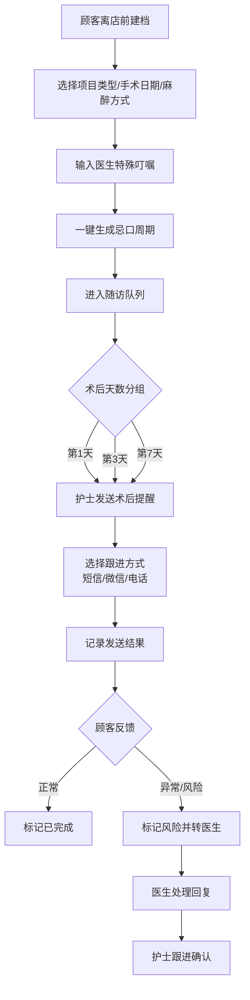
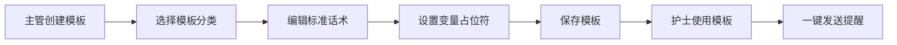

## 1. 产品概述

医美机构术后忌口随访工作台，旨在解决顾客做完医美项目后无人跟进、提醒标准不统一的痛点问题。通过标准化的忌口周期生成、智能随访分组、多渠道提醒触达和异常风险闭环管理，提升术后护理质量和顾客满意度。

- **核心目标**：建立标准化术后随访流程，确保每位顾客都能获得及时、专业的忌口指导
- **目标用户**：医美机构前台、护士、医生及主管
- **产品价值**：降低术后风险、统一服务标准、提升管理效率、增强顾客信任

## 2. 核心功能

### 2.1 用户角色

| 角色 | 登录方式 | 核心权限 |
|------|----------|----------|
| 前台 | 账号密码 | 顾客建档、项目配置、忌口周期生成 |
| 护士 | 账号密码 | 随访看板、提醒发送、打卡记录、异常上报 |
| 医生 | 账号密码 | 异常处理、特殊叮嘱、风险评估 |
| 主管 | 账号密码 | 数据统计、模板管理、员工绩效查看 |

### 2.2 功能模块

1. **顾客建档**：顾客信息录入、项目类型选择、手术日期设置、麻醉方式选择、医生特殊叮嘱、忌口周期一键生成
2. **随访看板**：今日待提醒列表、术后天数自动分组（第1天/第3天/第7天）、顾客卡片展示、跟进方式选择（短信/微信/电话）、发送记录留痕
3. **提醒模板**：标准话术管理、模板分类、模板编辑、节假日聚餐提醒模板
4. **异常处理**：风险标记、异常反馈记录、医生转诊、处理进度追踪
5. **数据统计**：随访完成率、异常处理时长、顾客满意度、趋势图表
6. **员工记录**：员工操作日志、工作量统计、绩效排名

### 2.3 页面详情

| 页面名称 | 模块名称 | 功能描述 |
|----------|----------|----------|
| 顾客建档页 | 顾客信息表单 | 姓名、电话、年龄、性别、过敏史等基本信息录入 |
| 顾客建档页 | 项目选择器 | 项目类型下拉选择、手术日期、麻醉方式、医生选择 |
| 顾客建档页 | 忌口生成器 | 根据项目自动匹配忌口周期、可手动调整、医生特殊叮嘱输入 |
| 随访看板页 | 分组标签栏 | 按术后第1天、第3天、第7天分组切换 |
| 随访看板页 | 顾客卡片列表 | 显示禁食重点、已读状态、最近打卡、异常标记 |
| 随访看板页 | 跟进操作面板 | 短信发送、微信小程序消息、电话记录、批量操作 |
| 提醒模板页 | 模板列表 | 标准话术模板展示、分类筛选 |
| 提醒模板页 | 模板编辑器 | 新增/编辑模板、变量占位符、预览功能 |
| 异常处理页 | 异常列表 | 风险等级、异常类型、处理状态、分配医生 |
| 异常处理页 | 异常详情 | 顾客信息、异常描述、处理记录、医生回复 |
| 数据统计页 | 概览卡片 | 随访完成率、异常数量、满意度评分、总随访数 |
| 数据统计页 | 趋势图表 | 周/月随访趋势、异常分布柱状图 |
| 员工记录页 | 员工列表 | 员工姓名、角色、随访量、完成率、排名 |
| 员工记录页 | 操作日志 | 详细操作记录、时间轴展示 |

## 3. 核心流程

### 3.1 建档随访主流程

前台在顾客离店前完成建档，系统自动生成随访计划，护士按计划执行提醒，异常情况转医生处理。

### 3.2 模板管理流程

## 4. 用户界面设计

### 4.1 设计风格

- **主色调**：医疗专业蓝（#2563EB）搭配柔和粉（#F472B6），体现医美行业的专业与柔美
- **辅助色**：成功绿（#10B981）、警告橙（#F59E0B）、危险红（#EF4444）
- **整体风格**：简约专业、卡片式布局、清爽干净，符合医疗健康类产品调性
- **按钮风格**：圆角矩形（8px）、主按钮填充、次按钮描边
- **字体**：Noto Sans SC 作为中文主字体，清晰易读
- **图标**：线性图标为主，保持简洁专业感
- **卡片设计**：白色卡片配浅灰边框，轻微阴影，悬停时阴影加深

### 4.2 页面设计概览

| 页面名称 | 模块名称 | UI元素 |
|----------|----------|--------|
| 顾客建档页 | 顶部导航 | Logo、模块导航、用户头像、消息通知 |
| 顾客建档页 | 表单区域 | 分栏布局、左侧基础信息、右侧项目配置 |
| 顾客建档页 | 忌口预览 | 时间轴样式展示忌口周期各阶段要求 |
| 随访看板页 | 分组标签 | Tab切换、带数字角标、活跃态高亮 |
| 随访看板页 | 顾客卡片 | 头像、姓名、术后天数标签、禁食重点、状态徽章 |
| 随访看板页 | 操作弹窗 | 模板选择、消息预览、发送按钮 |
| 提醒模板页 | 侧边分类 | 分类列表、模板数量、选中态 |
| 提醒模板页 | 模板卡片 | 标题、预览文字、使用次数、操作按钮 |
| 数据统计页 | 数据卡片 | 大数字展示、同比环比、趋势小图 |
| 数据统计页 | 图表区域 | 折线图/柱状图、图例、时间筛选 |

### 4.3 响应式设计

- **设计优先**：桌面端优先（1440px基准）
- **适配范围**：支持1280px ~ 1920px 常用桌面分辨率
- **布局策略**：卡片栅格布局，中等屏幕自动调整列数
- **交互优化**：所有按钮尺寸符合点击热区要求，表单输入框高度适中

## 5. 关键业务规则

### 5.1 忌口周期规则

- 不同项目类型对应不同忌口周期时长（如：双眼皮7天、颌面手术30天）
- 麻醉方式影响忌口内容（全麻术后6小时禁食、局麻无此限制）
- 医生特殊叮嘱可覆盖或补充标准忌口内容
- 忌口阶段分为：术后当天、第1-3天、第4-7天、恢复期

### 5.2 随访提醒规则

- 术后第1天、第3天、第7天为固定提醒节点
- 提醒时间默认为上午10:00，可按机构设置调整
- 未读提醒24小时后自动标记为待跟进
- 顾客打卡后自动更新最近打卡时间

### 5.3 异常处理规则

- 风险等级分：低（饮食轻微违规）、中（饮酒/辛辣）、高（伤口渗液/感染）
- 高风险异常需在2小时内转医生处理
- 异常处理完成后自动归档，计入统计数据
