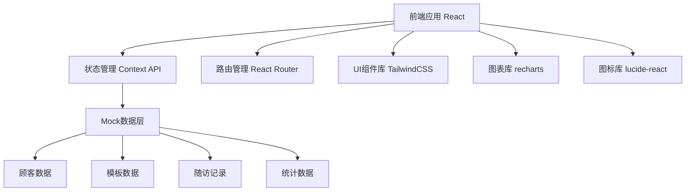
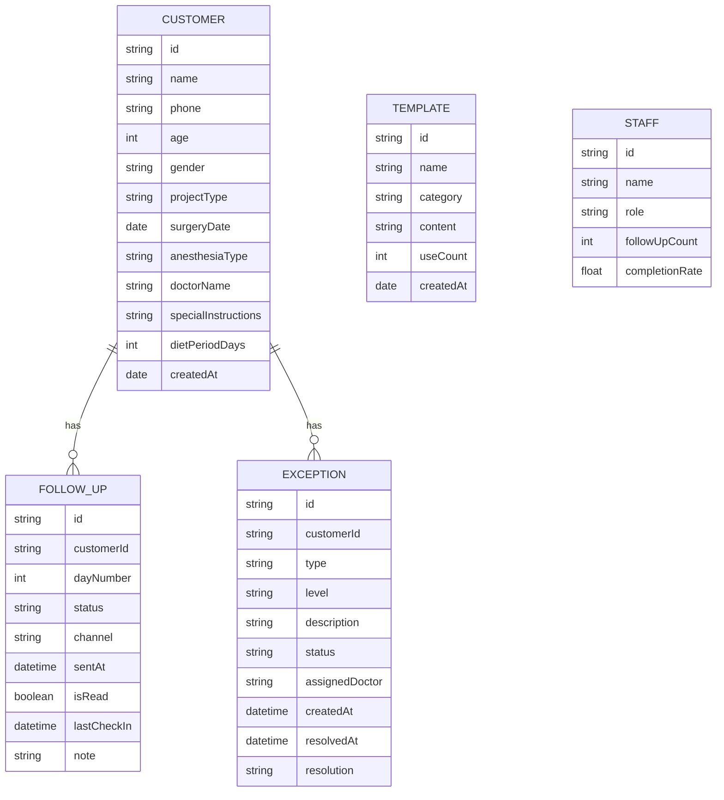

## 1. 架构设计

本项目为前端单页应用，使用 React + Vite 构建，采用 Mock 数据模拟后端接口，无需真实后端服务即可完整演示所有功能。



## 2. 技术描述

- **前端框架**：React@18 + TypeScript
- **构建工具**：Vite@5
- **样式方案**：TailwindCSS@3
- **路由管理**：react-router-dom@6
- **状态管理**：React Context + useReducer
- **图表组件**：recharts@2
- **图标库**：lucide-react
- **日期处理**：date-fns
- **数据方案**：Mock 数据 + LocalStorage 持久化

## 3. 路由定义

| 路由路径 | 页面名称 | 说明 |
|----------|----------|------|
| / | 随访看板 | 首页，默认显示今日待随访列表 |
| /customers | 顾客建档 | 顾客列表和新增顾客表单 |
| /customers/new | 新建顾客 | 顾客建档表单页 |
| /follow-up | 随访看板 | 按术后天数分组的随访列表 |
| /templates | 提醒模板 | 话术模板管理 |
| /exceptions | 异常处理 | 异常列表和详情处理 |
| /statistics | 数据统计 | 随访数据和图表展示 |
| /staff | 员工记录 | 员工操作日志和绩效 |

## 4. 数据模型

### 4.1 实体关系图



### 4.2 核心类型定义

```typescript
// 顾客信息
interface Customer {
  id: string;
  name: string;
  phone: string;
  age: number;
  gender: 'male' | 'female';
  projectType: string;
  surgeryDate: string;
  anesthesiaType: 'general' | 'local' | 'sedation';
  doctorName: string;
  specialInstructions: string;
  dietPeriodDays: number;
  createdAt: string;
}

// 随访记录
interface FollowUpRecord {
  id: string;
  customerId: string;
  dayNumber: number;
  status: 'pending' | 'sent' | 'read' | 'completed';
  channel: 'sms' | 'wechat' | 'phone' | null;
  sentAt: string | null;
  isRead: boolean;
  lastCheckIn: string | null;
  note: string;
}

// 异常记录
interface ExceptionRecord {
  id: string;
  customerId: string;
  type: string;
  level: 'low' | 'medium' | 'high';
  description: string;
  status: 'pending' | 'processing' | 'resolved';
  assignedDoctor: string | null;
  createdAt: string;
  resolvedAt: string | null;
  resolution: string;
}

// 提醒模板
interface Template {
  id: string;
  name: string;
  category: string;
  content: string;
  useCount: number;
  createdAt: string;
}

// 员工信息
interface Staff {
  id: string;
  name: string;
  avatar: string;
  role: 'reception' | 'nurse' | 'doctor' | 'manager';
  followUpCount: number;
  completionRate: number;
}
```

## 5. 项目目录结构

```
src/
├── components/          # 公共组件
│   ├── Layout/         # 布局组件
│   ├── Card/           # 卡片组件
│   ├── Modal/          # 弹窗组件
│   ├── Badge/          # 标签徽章
│   └── Chart/          # 图表组件
├── pages/              # 页面组件
│   ├── Dashboard/      # 随访看板
│   ├── Customers/      # 顾客建档
│   ├── Templates/      # 提醒模板
│   ├── Exceptions/     # 异常处理
│   ├── Statistics/     # 数据统计
│   └── Staff/          # 员工记录
├── context/            # 全局状态
│   └── AppContext.tsx
├── data/               # Mock数据
│   ├── customers.ts
│   ├── templates.ts
│   ├── followUps.ts
│   ├── exceptions.ts
│   └── staff.ts
├── types/              # 类型定义
│   └── index.ts
├── utils/              # 工具函数
│   ├── date.ts
│   └── diet.ts         # 忌口周期计算
├── App.tsx
├── main.tsx
└── index.css
```

## 6. 核心功能实现方案

### 6.1 忌口周期生成

根据项目类型和麻醉方式，在 `utils/diet.ts` 中实现忌口周期计算逻辑：

- 项目类型 → 基础忌口天数
- 麻醉方式 → 附加忌口要求
- 医生叮嘱 → 自定义补充

### 6.2 随访分组逻辑

基于手术日期计算术后天数，自动将顾客分配到第1天、第3天、第7天等不同分组中。

### 6.3 状态管理

使用 React Context 统一管理应用状态，包括顾客数据、随访记录、模板数据等，通过 LocalStorage 实现数据持久化。

### 6.4 图表展示

使用 recharts 库实现数据统计页面的折线图和柱状图，展示随访趋势和异常分布。
